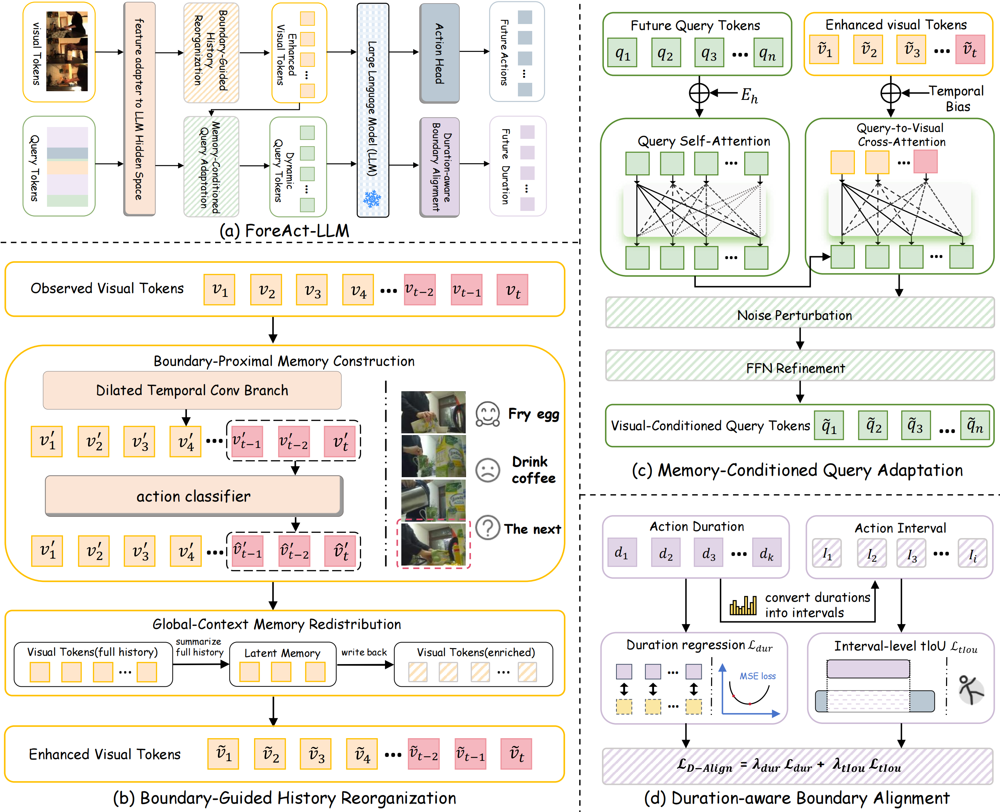

# ForeAct-LLM

implementation of Anonymous implementation for long-term action anticipation.
<p align="center">
  
</p>

ForeAct-LLM reorganizes observed video history into prediction-oriented visual memory, adapts future query tokens with visual memory, and aligns predicted action durations through interval-level temporal constraints.

## Structure

```text
ForeAct-LLM/
├── foreactllm/              # model, tokenizer, adapters, and LLM builder
├── util/                    # datasets, options, and training utilities
├── scripts/                 # data preparation and run scripts
├── assets/                  # framework figure
├── train.py                 # training entry
├── eval.py                  # evaluation entry
├── engine.py
├── requirements.txt
└── README.md
```

## Environment

Install PyTorch according to your CUDA version, then install the remaining dependencies:

```bash
pip install torch==2.8.0 torchvision==0.23.0 torchaudio==2.8.0 \
  --index-url https://download.pytorch.org/whl/cu128
pip install -r requirements.txt
```

## Data and Weights

Large files are not included. Please prepare LLaMA-7B weights and dataset features separately.

For Assembly101, the expected layout is:

```text
    ├── data/                      
        ├── 50_salads/ 
        │   ├── groundTruth/
        │   ├── features/
        │   ├── mapping.txt
        │   └── splits/             
        ├── breakfast/ 
        │   ├── groundTruth/
        │   ├── features/
        │   ├── mapping.txt
        │   └── splits/   
        ├── assembly101/ 
        │    ├── annotations/coarse-annotations/
        │   ├── actions.csv
        │   ├── coarse_labels/
        │   └── coarse_splits/
        ├── TSM_features/{video_id}/{view}/features.npy
        ├── mapping.txt
        └── splits/
        │    ├── train.csv
        │      └── val.csv                    
        ├── text_feature/ 
        │   ├── breakfast/
        │   └── 50_salads/  
        └── weights/ 
            └── 7B/      
                ├── checklist.chk
                ├── consolidated.00.pth
                ├── params.json
                └── ...       
	​

```

Prepare metadata:

```bash
python scripts/prepare_assembly101.py \
  --data-root /path/to/data \
  --dataset assembly101
```

Run a dataloader smoke test:

```bash
ROOT=/path/to/ForeAct-LLM \
DATA_ROOT=/path/to/data \
SAMPLE_RATE=8 \
N_QUERY=12 \
bash scripts/smoke_test.sh
```

## Training

```bash
ROOT=/path/to/ForeAct-LLM \
DATA_ROOT=/path/to/data \
LLAMA_PATH=/path/to/llama/7B \
GPU=0 \
EPOCHS=25 \
BATCH_SIZE=1 \
ACCUM_ITER=8 \
SAMPLE_RATE=8 \
N_QUERY=12 \
MAX_SEQ_LEN=3072 \
LR=1e-4 \
RUN_DIR=/path/to/output/assembly101 \
bash scripts/train_assembly101.sh
```

## Evaluation

```bash
ROOT=/path/to/ForeAct-LLM \
DATA_ROOT=/path/to/data \
LLAMA_PATH=/path/to/llama/7B \
RUN_DIR=/path/to/output/assembly101 \
START_EPOCH=0 \
END_EPOCH=24 \
bash scripts/eval_assembly101.sh
```

## Notes

- Do not upload datasets, LLaMA weights, checkpoints, or logs to GitHub.
- For anonymous review, remove personal paths and account information.
- More detailed instructions will be provided in the final release.
